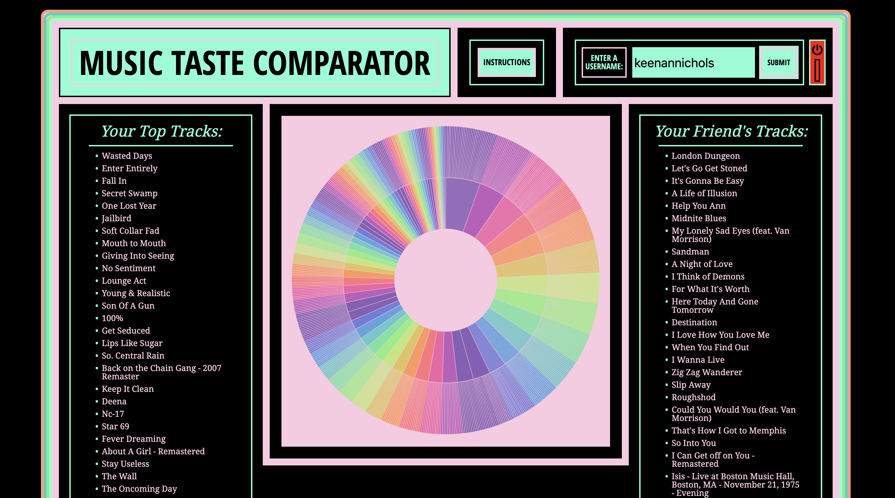
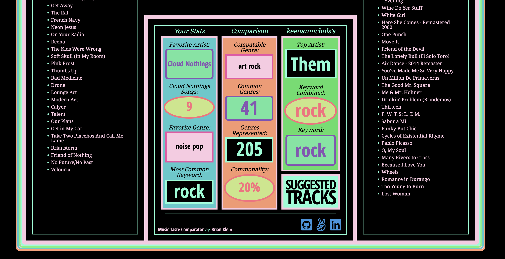

# README

Music Taste Comparator
=
[Live Site](https://music-taste-comparator.herokuapp.com/)
A data visualizer for comparing taste between two Spotify users

Thank you for visiting Music Taste Comparator. Music-Taste-Comparator is a data visualization and recommendation generator that takes in a current user and another searched username. Using the Spotify API, data is retrieved on the current user which is used to create a visualization of their top artists, tracks, genres, etc. Using the searched username, the Spotify API will fetch the public playlists of that username and that data will be used to make a comparison of the comonalities and differences between the 2 users in order to show how much they have in common and what artists or tracks the current user might be interested in that do not show in the current users data.


## Functionality
=
The user will log in to their account setting them as the current user. This gives access to all of their Spotify data through the API. This will generate a visualization of all their top artists, tracks, genres, and relevant information. The user can then input a username of one of their friends or a user they follow. This will then generate a data visualization of any public information that user is allowing access to. Based on that data, a visualization will be generated representing the comonalities and differences between those two users. A list of suggested tracks will be generated based on top tracks of the inputed user.


## Technologies Implemented:
- JavaScript
- Spotify API
- D3.js
- CSS3
- HTML5

## Features
- ### User Authentication
  - Users log in to their Spotify account through the Spotify API
  - A demo user account is provided for guests who are not Spotify users
- ### User Data Visualization
  - Users Spotify data is fetched
  - A visualization is generated via D3.js and CSS3 styling
- ### User Search
  - User can search the username of a friend or account of interest
  - Searched username's public data is fetched through Spotify API
  - Searched username's data is incorporated into the visualization
- ### Suggested Tracks
  - Current user and searched user's data is compared through common genres and keywords
  - A display is generated showing commonalities in the comaraed data
  - A list of tracks is generated from the searched user based on commonalities



## Noteworthy Code Snippets
Here we see the first section of the Spotify Auth and data retrieval
```Javascript
module.exports.spotifyAuth = function (req, res) {
    spotifyAPI.authorizationCodeGrant(req.query.code).then(function (data) {
    spotifyAPI.setAccessToken(data.body.access_token);
    spotifyAPI.setRefreshToken(data.body.refresh_token);
    return spotifyAPI.getMe()
    }).then(function () {
        spotifyAPI
        .getMyTopTracks({ limit: 50 })
        .then(function (data){
            return {
                tracks: data.body.items,
                trackIds: data.body.items.map(track => {
                   return track.id
                }),
                artistIds: data.body.items.map(track => {
                    return track.artists[0].id
                })
            }
        })
        .then(function ({tracks, trackIds, artistIds}) {
            return {
                tracks,
                audioData: spotifyAPI.getAudioFeaturesForTracks(trackIds),
                artistData: spotifyAPI.getArtists(artistIds)
            }
        })
  ...
```

The following shows the first section of the D3.js function that is responsible for creating the visualization of the song titles and genres
```Javascript
function  createPie(data_obj) {
        const data = data_obj;
        const width = 700;
        const height = 700;
        const radius = width/2;
        const format = d3.format(",d");
        const color = d3.scaleOrdinal(d3.quantize(d3.interpolateRainbow, 13));
        function autoBox() {
            const {x, y, width, height} = this.getBBox();
            return [x, y, width, height];
        };
        const arc = d3.arc()
        .startAngle(d => d.x0)
        .endAngle(d => d.x1)
        .padAngle(d => Math.min((d.x1 - d.x0) / 2, 0.005))
        .padRadius(radius / 2)
        .innerRadius(d => d.y0)
        .outerRadius(d => d.y1 - 1);
            
        const partition = data => d3.partition()
        .size([2 * Math.PI, radius])
        (d3.hierarchy(data)
        .sum(d => d.value)
        .sort((a, b) => b.value - a.value));
  ...
```

<!-- ## Wire Frame
The page consists of a single screen showing the current_user spotify username, an input for the searched username, a datavisualization of their compared data, and a list of suggested tracks based on the compared data.
 -->

